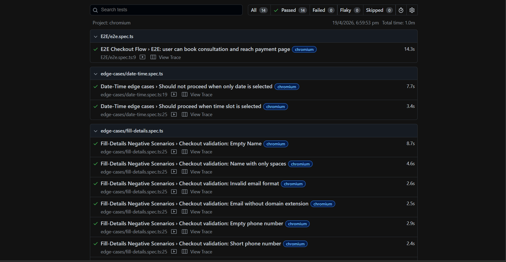
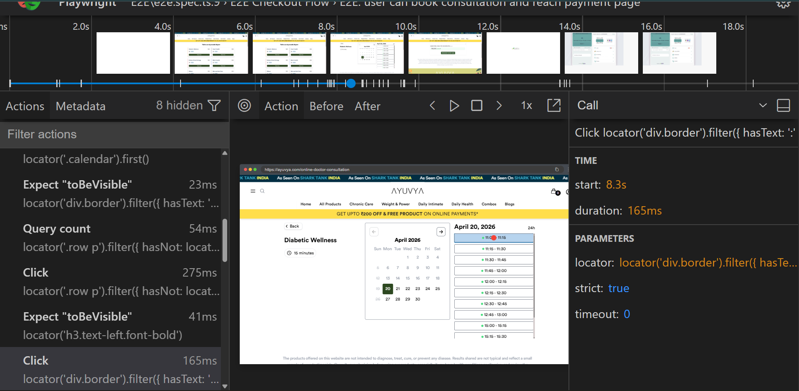
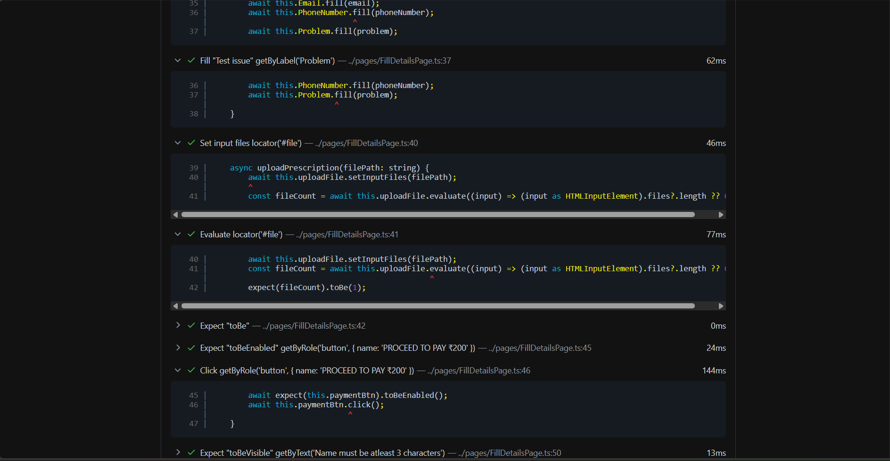
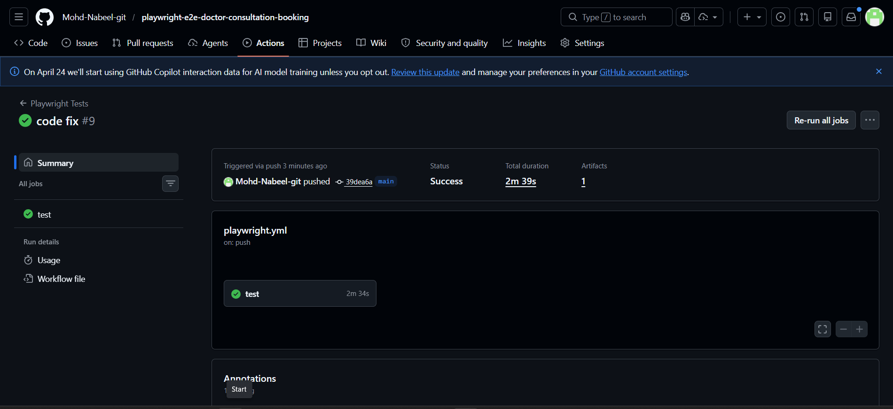

# 🧪 Playwright E2E Doctor Consultation Booking

A **production-ready end-to-end test automation framework** built using **Playwright + TypeScript**, designed to validate a real-world **doctor consultation booking SPA** with robust edge-case coverage and CI integration.

---

## 🚀 Features

- ✅ End-to-End (E2E) automation for complete booking workflow  
- ✅ Page Object Model (POM) for scalable and maintainable structure  
- ✅ Data-driven testing using JSON  
- ✅ Comprehensive edge-case validation  
- ✅ File upload validation testing  
- ✅ UI-based assertions for SPA behavior  
- ✅ CI/CD integration with GitHub Actions  
- ✅ HTML test reports with trace viewer support  

---

## 🛠 Tech Stack

- **Automation Tool:** Playwright  
- **Language:** TypeScript  
- **Runtime:** Node.js  
- **Architecture:** Page Object Model (POM)  
- **CI/CD:** GitHub Actions  

---

## 📂 Project Structure

playwright-e2e-doctor-consultation-booking/
│
├── tests/
│ ├── e2e/
│ │ └── e2e.spec.ts
│ └── edge-cases/
│ ├── date-time.spec.ts
│ └── fill-details.spec.ts
│
├── pages/
│ ├── ConsultationPage.ts
│ ├── DateTimePage.ts
│ ├── FillDetailsPage.ts
│ └── PaymentPage.ts
│
├── utils/
│ └── testData.json
│
├── playwright.config.ts
├── package.json
└── .github/workflows/playwright.yml

---

## 🧪 Test Coverage

### 🔹 End-to-End Flow

Validates complete booking journey:

1. Select consultation  
2. Choose date & time slot  
3. Fill user details (with validation)  
4. Proceed to payment page  

---

### 🔹 Edge Case Testing

#### 📅 Date-Time Selection
- ❌ Prevent proceeding without selecting time slot  
- ✅ Allow proceeding when valid slot is selected  

#### 📝 Form Validation
- Empty name  
- Name with only spaces  
- Invalid email format  
- Email without domain extension  
- Empty phone number  
- Short phone number  

#### 📎 Optional Fields
- Email field optional handling  
- File upload validation (prescription upload)  

---

## ⚠️ Special Challenges Handled

### 🔹 SPA Behavior
- Application is a **Single Page Application (SPA)**  
- No URL change across steps  
- Implemented **UI-based assertions instead of URL validation**  

### 🔹 Payment Gateway Limitation
- Uses **third-party Cashfree payment gateway**  
- Payment step is:
  - Triggered and validated partially  
  - Not strictly asserted in CI (external dependency)  

---

## ▶️ Run Tests Locally

```bash
# Clone repository
git clone https://github.com/Mohd-Nabeel-git/playwright-e2e-doctor-consultation-booking.git

# Navigate to project
cd playwright-e2e-doctor-consultation-booking

# Install dependencies
npm install

# Install Playwright browsers
npx playwright install

# Run tests
npx playwright test

# Open HTML report
npx playwright show-report

---

## 🔄 CI/CD Integration

```bash 
- Integrated with **GitHub Actions**  
- Runs tests on every push  
- Generates **HTML report as artifact**  
- Ensures **CI-stable execution**  

**Workflow file:** .github/workflows/playwright.yml

---

## 📸 Screenshots

> Place your screenshots inside `/screenshots` folder and use the references below

### 🧪 Test Execution Report


### 📊 Trace Viewer (Step-by-Step Execution)


### 📝 Fill Details Validation


### ✅ GitHub Actions CI Success


---

## ⭐ Key Highlights (For Recruiters)

- 🚀 Built **real-world SPA automation framework**  
- 🧠 Handled **complex UI flows without URL reliance**  
- 📊 Implemented **data-driven + edge-case testing strategy**  
- 🧱 Designed using **scalable POM architecture**  
- 🔄 Integrated **CI/CD pipeline with GitHub Actions**  
- 🧪 Covered both **functional + negative test scenarios**  
- 📁 Maintained **clean, modular, and reusable codebase**  

---

## 📌 Conclusion

This project demonstrates strong **SDET-level skills**, including:

- End-to-end automation design  
- Handling real-world testing challenges (**SPA + third-party systems**)  
- Writing maintainable and scalable test frameworks  
- Ensuring reliability through CI/CD pipelines  

---

## 👤 Author

**Mohd Nabeel**

- 🔗 GitHub: https://github.com/Mohd-Nabeel-git  
- 💼 LinkedIn: https://www.linkedin.com/in/mohd-nabeel-18231a319/  